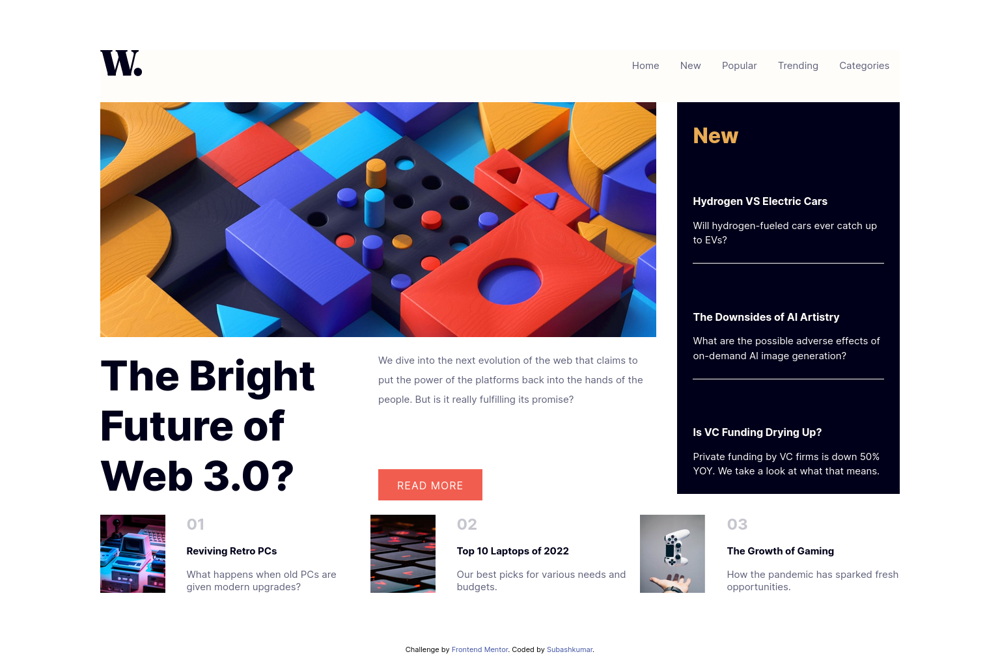

# Frontend Mentor - News homepage solution

This is a solution to the [News homepage challenge on Frontend Mentor](https://www.frontendmentor.io/challenges/news-homepage-H6SWTa1MFl). Frontend Mentor challenges help you improve your coding skills by building realistic projects. 

## Table of contents

- [Frontend Mentor - News homepage solution](#frontend-mentor---news-homepage-solution)
  - [Table of contents](#table-of-contents)
  - [Overview](#overview)
    - [The challenge](#the-challenge)
    - [Screenshot](#screenshot)
    - [Links](#links)
  - [My process](#my-process)
    - [Built with](#built-with)
    - [What I learned](#what-i-learned)
    - [Continued development](#continued-development)
    - [Useful resources](#useful-resources)
  - [Author](#author)
  - [Acknowledgments](#acknowledgments)

**Note: Delete this note and update the table of contents based on what sections you keep.**

## Overview

### The challenge

Users should be able to:

- View the optimal layout for the interface depending on their device's screen size
- See hover and focus states for all interactive elements on the page

### Screenshot
Desktop view:

Mobile view:


### Links

- Solution URL: (https://github.com/Subashkumar-S/Frontend_Mentor_NEWS_homepage)
- Live Site URL: (https://news-home-main-page.web.app/index.html)

## My process

### Built with

- Semantic HTML5 markup
- CSS custom properties
- Flexbox
- CSS Grid
- Mobile-first workflow
- JavaScript


### What I learned

This challenge helps me to understand the working CSS Grid properties like grid-template-columns. I have learned making a responsive navbar.

To make responsive navbar I have used properties below:


```css
@media (max-width: 675px){
    .toggle[aria-expanded="true"]{
        background: url(assets/images/icon-menu-close.svg);
    }
    .navlist{
        position: fixed;
        top: 0;
        right: 0;
        width: 60%;
        height: 100vh;
        flex-direction: column;
        justify-content: flex-start;
        align-items: start;
        background-color: var(--off-white);
        padding-top: 20vh;
        padding-left: 1rem;
        gap: 1.5rem;
        transform: translateX(100%);
        transition: transform 450ms ease-out;
    }
    .navlist li a{
        color: var(--very-dark-blue);
    }
    .navlist[data-visible="true"]{
        transform: translateX(0%);
    }
    .toggle{
        display: block;
        position: absolute;
        width: 2rem;
        aspect-ratio: 1;
        background: url(assets/images/icon-menu.svg);
        background-size: cover;
        background-repeat: no-repeat;
        top: 0;
        right: 0;
        z-index: 9999;
        border: none;
        margin-top: 5%;
        margin-right: 10%;
    }
}
```
```js
const toggle = document.querySelector(".toggle");
const navbar = document.getElementById("navlist");
toggle.addEventListener("click" , function(){
   const visibility = navbar.getAttribute("data-visible");
   if(visibility === "false"){
    navbar.setAttribute("data-visible", true);
    toggle.setAttribute("aria-expanded", true);
   }else{
    navbar.setAttribute("data-visible", false);
    toggle.setAttribute("aria-expanded", false);
   }
});
```


### Continued development

To practice more CSS and JavaScript helps me to focus on future projects.

### Useful resources

- (https://developer.mozilla.org/en-US/docs/Glossary/Grid) - This helped me for understand Grid layout.


## Author

<!-- - Website - [Subashkumar S] -->
- Frontend Mentor - [@Subashkumar-S](https://www.frontendmentor.io/profile/Subashkumar-S)


## Acknowledgments

-To make mobile responsive navbar I refer this video.[](https://www.youtube.com/watch?v=HbBMp6yUXO0&t=2332s) 


